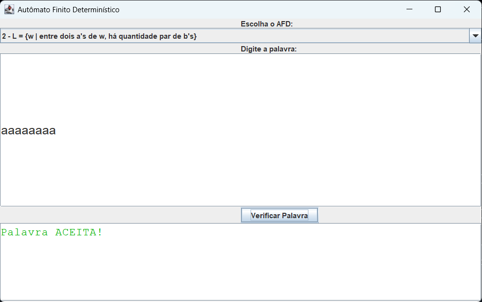
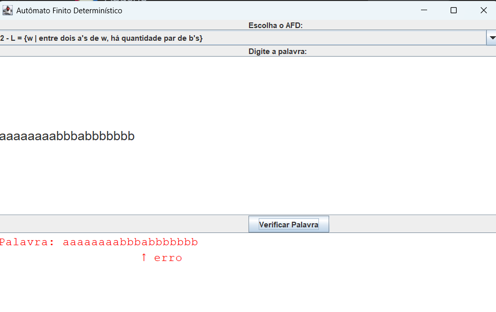

# 🧠 Autômato Finito Determinístico (AFD) - Verificador de Palavras

Este é um projeto Java que simula **Autômatos Finitos Determinísticos (AFDs)** para verificar se palavras pertencem a determinadas linguagens formais. A interface gráfica permite ao usuário selecionar um autômato, digitar uma palavra e visualizar passo a passo onde a palavra é aceita ou rejeitada.

## 👨‍💻 Autores

- [Igor Xisto](https://github.com/IgorXF)
- [Mylena Antonelli](https://github.com/mylenaantonelli)

## 🚀 Funcionalidades

- Interface gráfica com **seleção de autômato (AFD)**.
- Campo para digitação da palavra com **fonte aumentada e barra de rolagem horizontal**.
- Verificação automática ao clicar em "Verificar Palavra".
- Destaca o caractere onde o erro ocorreu (com setinha abaixo).
- Mensagens visuais:
  - ✅ Verde para palavras aceitas.
  - ❌ Vermelha para palavras rejeitadas ou que terminam em estado não final.
- Arquitetura separada entre interface, lógica de AFD e serialização de arquivos CSV.

---

## 📁 Exemplo de Arquivo CSV

Os arquivos `.csv` descrevem a estrutura do autômato com suas transições e estados finais. O formato é simples:

```
finais;3
0;a;1
0;b;0
1;a;3
1;b;2
2;a;3
2;b;0
3;a;3
3;b;3
```

- A primeira linha define os **estados finais** (`finais;3`).
- As demais representam transições no formato:
  ```
  estadoOrigem;simbolo;estadoDestino
  ```

### 💡 Linguagem Representada

Esse AFD reconhece a linguagem:

> **L = {w | w tenha `aa` ou `aba` como subpalavra}**

Exemplos:
- ✅ Aceita: `"aa"`, `"aba"`, `"aabaa"`, `"baaa"`
- ❌ Rejeita: `"a"`, `"ab"`, `"bab"`

---

## 📦 Estrutura de Pastas

```
src/
├── com.mycompany.automatofinito
│   ├── classes/            # Lógica de AFD e transições
│   ├── serializadorCSV/    # Leitura e escrita de arquivos CSV
│   └── viw/                # Interface gráfica (Swing)
├── arquivos(na raiz)       # Arquivos CSV com autômatos
```

---

## 🛠️ Tecnologias

- Java SE 8+
- Swing (interface gráfica)
- Arquivos `.csv` para definição dos AFDs

---

## 🧩 Funcionalidades Futuras

- Tela para o **usuário criar e editar autômatos manualmente** (sem usar arquivos CSV).
- Suporte a **AFNs** (Autômatos Finitos Não Determinísticos).
- Exportação de autômatos visuais.
- Animação passo a passo da execução.

---

## 📸 Capturas de Tela

### ✅ Palavra aceita


### ❌ Palavra rejeitada


---

## 🤝 Contribuição

Sinta-se à vontade para abrir *issues* ou enviar *pull requests* com melhorias, correções ou sugestões!

---

